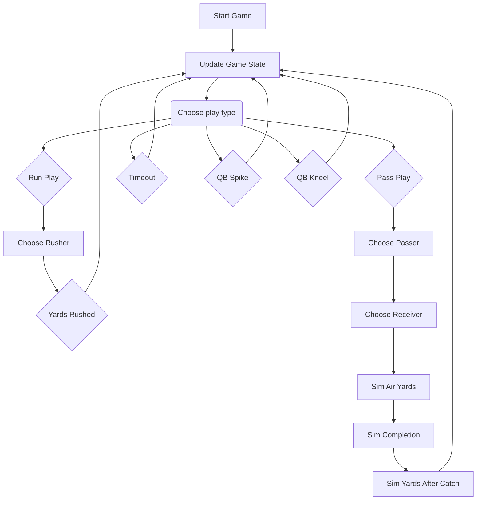

# NFL Game Simulator

Each of the boxes below has an ML model associated with it that takes in features of the game state, offensive and defensive teams and players. 
Here's the flow for the simulation:

